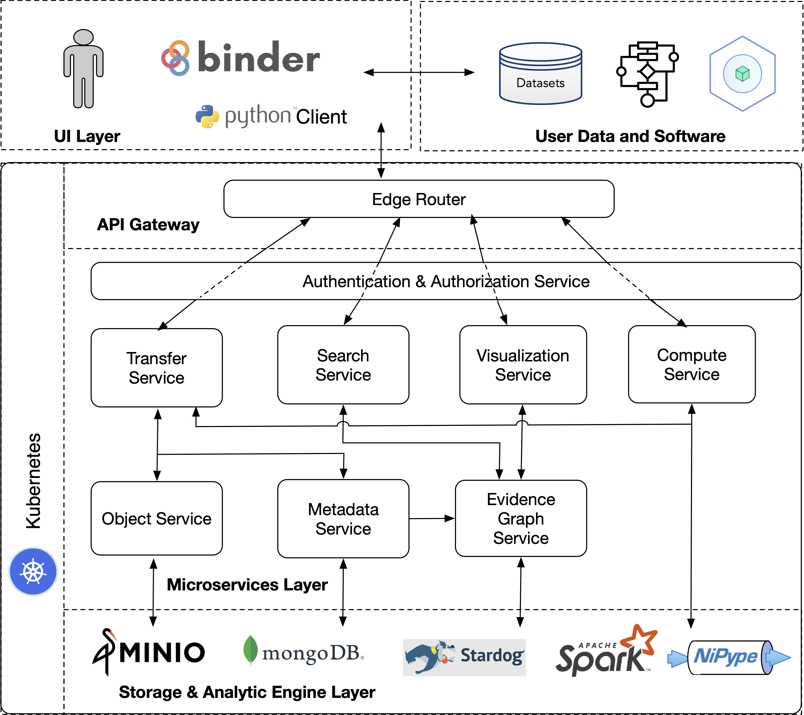

# Spark Demo

# Introduction

**Service Defintions**

    Metadata Service (MDS): Handles minting identifiers...
    Transfer Service: Used to upload data with associated metadata to framework
    Compute Service: Runs compuations on uploaded data.
    Evidence Graph Service: Queries Stardog to build Evidence Graph tracking object proveance

**Outline**

    1.) Upload data to the framework
    2.) Retreive metadata of an uploaded object using MDS
    3.) Run a spark job on the uploaded data
    4.) Create a graphic from the job output
    5.) Visualize evidence graph of the image

**Microservices Model**





**Also Available**
<br>
[Code Here](https://github.com/fairscape/Nipype-Demo)

[Deepnote Published Notebook](https://deepnote.com/publish/bc340822-0e82-4268-b78e-75ff37f19837)


# Step 1: **Create Required Service Account for Spark**


```shell
kubectl create serviceaccount -n default spark
kubectl create clusterrolebinding spark-role  --clusterrole=edit  --serviceaccount=default:spark  --namespace=default
```


# Step 2: Port Forward

To run the demo locally you need to access the notebook within the testing pod. To do this simply forward the testing-pod port using below (add & if you'd prefer to run the command in background):

```shell
kubectl port-forward testing-pod 8888:8888
```
And if you want to view the visual locally in another terminal forward the visualization service as well with:

```shell
kubectl port-forward visual 5000:5000
```

# Step 3: Visit localhost:8888
The demo is now being hosted locally at [HERE](http://localhost:8888)
**Open the Spark-Demo.ipynb and get started!**
Note: If the demo fails unexpectedly try increasing the docker desktop/minikubes virtual memory. 
