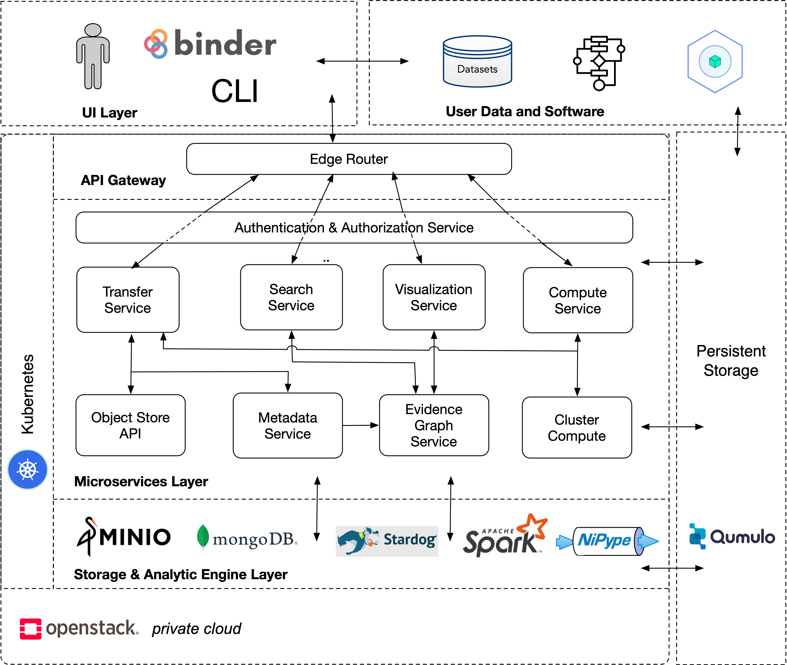
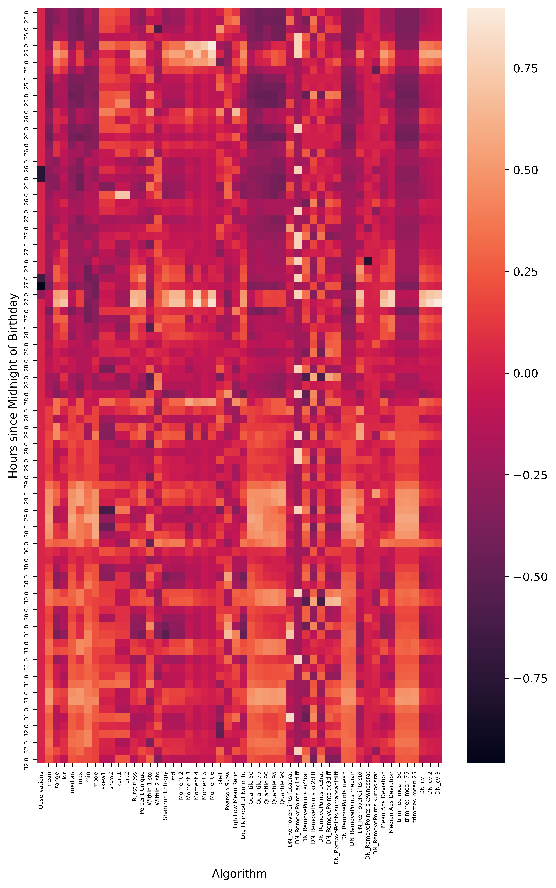

# Spark Demo

## Also Available
[Code Here](https://github.com/fairscape/Nipype-Demo)

[Deepnote Published Notebook](https://deepnote.com/publish/bc340822-0e82-4268-b78e-75ff37f19837)

## Microservices Model


```python
from IPython.display import Image
Image(filename="../Microservice Framework v6.png")
```





```python
import requests, json, jwt
import FAIR
```

## First get authorized

Visit:
<br>
https://clarklab.uvarc.io/auth/login
<br>
And copy and paste access token below. If local create test webtoken with below.


```python
token = jwt.encode({'name': 'Admin','role':'admin','sub':'admin-id','groups':['test'],'aud':'https://fairscape.org'}, 'test secret', algorithm='HS256')
```

## Using Transfer Service upload data with metadata

Upload a file to minio via the upload_file function.
<br>
<br>
upload_file takes:
        - file_path: path to local file
        - metadata: describes the file to be uploaded
returns:
    - PID representing object
upload_file then calls the transfer service which uploads the file to minio and metadata to mongoDB and Stardog


```python
dataset_meta = {
    "@context":{
        "@vocab":"http://schema.org/"
    },
    "@type":"Dataset",
    "name":"Raw Data",
    "description":"Heart Rate Measures from patient from admission to discharge.",
    "author":[
        {
            "name":"Justin Niestroy",
            "@id": "https://orcid.org/0000-0002-1103-3882",
            "affiliation":"University of Virginia"
        }
    ],
}
data_id = FAIR.upload_file('UVA_7129_HR2.csv',dataset_meta,token = token)
data_id
```


    'ark:99999/bd3d2e2b-3bc1-49b4-8b2e-fc2c0000b715'


## Check MDS to make sure metadata was uploaded correctly

retrieve_metadata calls MDS to get the metadata for the newly minted id.
<br>
<br>
retrieve_metadata takes:
    - PID: identifier of interest
returns:
    - json-ld metadata of given PID


```python
FAIR.retrieve_metadata(data_id,token = token)
```


    {'@context': {'@vocab': 'http://schema.org/'},
     '@id': 'ark:99999/bd3d2e2b-3bc1-49b4-8b2e-fc2c0000b715',
     '@type': 'Dataset',
     'author': [{'@id': 'https://orcid.org/0000-0002-1103-3882',
       'affiliation': 'University of Virginia',
       'name': 'Justin Niestroy'}],
     'description': 'Heart Rate Measures from patient from admission to discharge.',
     'distribution': [{'@id': 'ark:99999/556c9199-396b-488c-9144-793448f50dc2'}],
     'name': 'Raw Data',
     'sdPublicationDate': '2020-11-19T21:42:44.907022589Z',
     'sdPublisher': {'@id': 'c5c0c8d8-656b-4189-9967-44c45624d283',
      'name': 'Justin Admin'},
     'url': 'http://ors.uvadcos.io/ark:99999/bd3d2e2b-3bc1-49b4-8b2e-fc2c0000b715'}


## Upload Spark Script to run on newly uploaded data


```python
spark_code_meta = {
    "@context":{
        "@vocab":"http://schema.org/"
    },
    "@type":"SoftwareSourceCode",
    "name":"Processing  Script",
    "description":"Sample Source Code for HCTSA test on spark",
    "author":[
        {
            "name":"Justin Niestroy",
            "@id": "https://orcid.org/0000-0002-1103-3882",
            "affiliation":"University of Virginia"
      }
    ]
}
software_id = FAIR.upload_file('run_algos.py',spark_code_meta,token = token)
software_id
```


    'ark:99999/34d26e0d-48e4-422b-b21f-e178cdeae71e'


## Submit Spark Job Using Compute Service

Run a the uploaded script on the uploaded data by calling compute
<br>
<br>
FAIR.compute takes:
    - data pid
    - software pid
    - type of job ie spark,nipype,custom  
compute then launches kubernetes pods to run the given script on the provided data using specialized pods
<br>
<br>
compute returns:
    - job_PID


```python
job_id = FAIR.compute(data_id,software_id,'spark',token = token)
job_id
```


    'ark:99999/cd6b791f-b256-44aa-836a-53f988bfdf2d'


## Watch Running Job
list_running_jobs takes:
<br>
<br>
list_running_jobs returns:
    - list of running job PIDs


```python
FAIR.list_running_jobs(token = token)
```


    ['sparkjob-cd6b791f-b256-44aa-836a-53f988bfdf2d']


## Get Job outputs from job metadata

Upon completion of a job the compute service updates the job id metadata to include properties:
    - evi:supports: list of output PIDs
    - logs: logs from job


```python
job_metadata = FAIR.retrieve_metadata(job_id,token = token)
output_ids = job_metadata.get('evi:supports')
output_ids
```


    [{'@id': 'ark:99999/6adb1f78-37f5-4a8e-a080-8a8b12b168b6'},
     {'@id': 'ark:99999/7a7b5fd4-ddd0-49bd-bb00-7aaed255ba6c'}]


The computation created 2 outputs
<br>
Metadata for the two created outputs is shown below


```python
output_metadata = [
   FAIR.retrieve_metadata(out['@id'],token = token) for out in output_ids
]
output_metadata
```


    [{'@context': {'@vocab': 'http://schema.org/'},
      '@id': 'ark:99999/6adb1f78-37f5-4a8e-a080-8a8b12b168b6',
      '@type': 'Dataset',
      'distribution': [{'@id': 'ark:99999/b7f1a6d3-27f3-4ae3-a2f4-3610c547eb13',
        '@type': 'DataDownload',
        'contentUrl': 'minio:9000/breakfast/cd6b791f-b256-44aa-836a-53f988bfdf2d/_SUCCESS',
        'fileFormat': '_SUCCESS',
        'name': '_SUCCESS'}],
      'evi:generatedBy': {'@id': 'ark:99999/cd6b791f-b256-44aa-836a-53f988bfdf2d'},
      'name': '_SUCCESS',
      'sdPublicationDate': '2020-11-20T14:53:50.01144214Z',
      'sdPublisher': {'@id': 'c5c0c8d8-656b-4189-9967-44c45624d283',
       'name': 'Justin Admin'},
      'url': 'http://ors.uvadcos.io/ark:99999/6adb1f78-37f5-4a8e-a080-8a8b12b168b6'},
     {'@context': {'@vocab': 'http://schema.org/'},
      '@id': 'ark:99999/7a7b5fd4-ddd0-49bd-bb00-7aaed255ba6c',
      '@type': 'Dataset',
      'distribution': [{'@id': 'ark:99999/7bcab29b-b8df-44fc-adba-cd1d97c8f4f7',
        '@type': 'DataDownload',
        'contentUrl': 'minio:9000/breakfast/cd6b791f-b256-44aa-836a-53f988bfdf2d/part-00000-bd1082b3-441e-4b9e-a786-e4a2f224f913-c000.csv',
        'fileFormat': 'csv',
        'name': 'part-00000-bd1082b3-441e-4b9e-a786-e4a2f224f913-c000.csv'}],
      'evi:generatedBy': {'@id': 'ark:99999/cd6b791f-b256-44aa-836a-53f988bfdf2d'},
      'name': 'part-00000-bd1082b3-441e-4b9e-a786-e4a2f224f913-c000.csv',
      'sdPublicationDate': '2020-11-20T14:53:50.308526947Z',
      'sdPublisher': {'@id': 'c5c0c8d8-656b-4189-9967-44c45624d283',
       'name': 'Justin Admin'},
      'url': 'http://ors.uvadcos.io/ark:99999/7a7b5fd4-ddd0-49bd-bb00-7aaed255ba6c'}]


## Upload Image Code


```python
spark_graphic_meta = {
    "@context":{
        "@vocab":"http://schema.org/"
    },
    "@type":"SoftwareSourceCode",
    "name":"Image Script",
    "description":"Creates heatmap of patients stay",
    "author":[
        {
            "name":"Justin Niestroy",
            "@id": "https://orcid.org/0000-0002-1103-3882",
            "affiliation":"University of Virginia"
      }
    ]
}
graphic_code_id = FAIR.upload_file('make_graphic.py',spark_graphic_meta,token = token)
```

## Run Spark Job to create Image


```python
image_job_id = FAIR.compute(output_ids[1]['@id'],graphic_code_id,'spark',token = token)
image_job_id
```


    'ark:99999/8e8c4cf7-7c5b-44ef-8297-7c05b63a5589'


## Check on running jobs


```python
FAIR.list_running_jobs(token = token)
```


    []


### Get image ID from Updated Job ID


```python
image_job_meta = FAIR.retrieve_metadata(image_job_id,token = token)
image_id = image_job_meta['evi:supports'][0]['@id']
```

## Get the image metadata


```python
FAIR.retrieve_metadata(image_id,token = token)
```


    {'@context': {'@vocab': 'http://schema.org/'},
     '@id': 'ark:99999/cba40fcd-c191-4183-b036-41d63f61d911',
     '@type': 'Dataset',
     'distribution': [{'@id': 'ark:99999/dc50156b-4ed7-46ac-afff-8c7a31521a51',
       '@type': 'DataDownload',
       'contentUrl': 'minio:9000/breakfast/8e8c4cf7-7c5b-44ef-8297-7c05b63a5589/Histogram_Heatmap.png',
       'fileFormat': 'png',
       'name': 'Histogram_Heatmap.png'}],
     'evi:generatedBy': {'@id': 'ark:99999/8e8c4cf7-7c5b-44ef-8297-7c05b63a5589'},
     'name': 'Histogram_Heatmap.png',
     'sdPublicationDate': '2020-11-20T15:04:06.112556684Z',
     'sdPublisher': {'@id': 'c5c0c8d8-656b-4189-9967-44c45624d283',
      'name': 'Justin Admin'},
     'url': 'http://ors.uvadcos.io/ark:99999/cba40fcd-c191-4183-b036-41d63f61d911'}


### Build Evidence graph of created image using the evidence graph service

Evidence Graph Service builds an json-ld evidence graph representing the provenance (datasets, software, and computations that support the PID)
<br>
<br>
evidence_graph takes:
    - PID
evidence_graph returns:
    - json-ld evidence graph for given PID


```python
FAIR.evidence_graph(image_id,token = token)
```


    {'@context': {'@vocab': 'http://schema.org/', 'evi': 'http://w3id.org/EVI#'},
     '@id': 'ark:99999/cba40fcd-c191-4183-b036-41d63f61d911',
     '@type': 'Dataset',
     'evi:generatedBy': {'@id': 'ark:99999/8e8c4cf7-7c5b-44ef-8297-7c05b63a5589',
      '@type': 'evi:Computation',
      'evi:usedDataset': {'@id': 'ark:99999/7a7b5fd4-ddd0-49bd-bb00-7aaed255ba6c',
       '@type': 'Dataset',
       'evi:generatedBy': {'@id': 'ark:99999/cd6b791f-b256-44aa-836a-53f988bfdf2d',
        '@type': 'evi:Computation',
        'evi:usedDataset': {'@id': 'ark:99999/bd3d2e2b-3bc1-49b4-8b2e-fc2c0000b715',
         '@type': 'Dataset',
         'author': {'@id': 'https://orcid.org/0000-0002-1103-3882',
          '@type': 'Person',
          'name': 'Justin Niestroy'},
         'name': 'Raw Data'},
        'evi:usedSoftware': {'@id': 'ark:99999/34d26e0d-48e4-422b-b21f-e178cdeae71e',
         '@type': 'SoftwareSourceCode',
         'author': {'@id': 'https://orcid.org/0000-0002-1103-3882',
          '@type': 'Person',
          'name': 'Justin Niestroy'},
         'name': 'Processing  Script'},
        'name': 'Computation'},
       'name': 'part-00000-bd1082b3-441e-4b9e-a786-e4a2f224f913-c000.csv'},
      'evi:usedSoftware': {'@id': 'ark:99999/b9739256-81eb-4159-acd6-8ddd21c97d95',
       '@type': 'SoftwareSourceCode',
       'author': {'@id': 'https://orcid.org/0000-0002-1103-3882',
        '@type': 'Person',
        'name': 'Justin Niestroy'},
       'name': 'Image Script'},
      'name': 'Computation'},
     'name': 'Histogram_Heatmap.png'}


## View Visualization of the Evidence Graph


```python
'https://clarklab.uvarc.io/viz/' + image_id
```


    'https://clarklab.uvarc.io/viz/ark:99999/cba40fcd-c191-4183-b036-41d63f61d911'


## Download Created Image

Download output files from computations using download_file
<br>
<br>
download_file takes:
    - PID: id representing object to be downloaded
    - name: file name for downloaded object
<br>
download_file returns:<br>
         - bool: True if download if succesful<br>
         - file saved location given


```python
from IPython.display import Image
FAIR.download_file(image_id,'Created Image.png',token = token)
Image(filename='Created Image.png')
```





```python
r = requests.post('https://clarklab.uvarc.io/auth/logout',headers = {"Authorization":token })
r.content.decode()
```


```python

```
